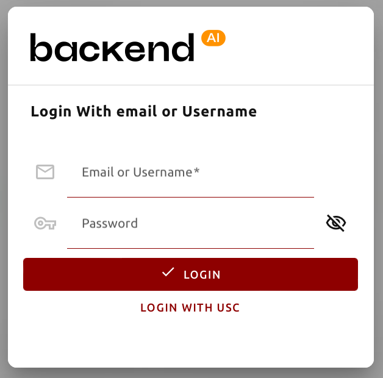
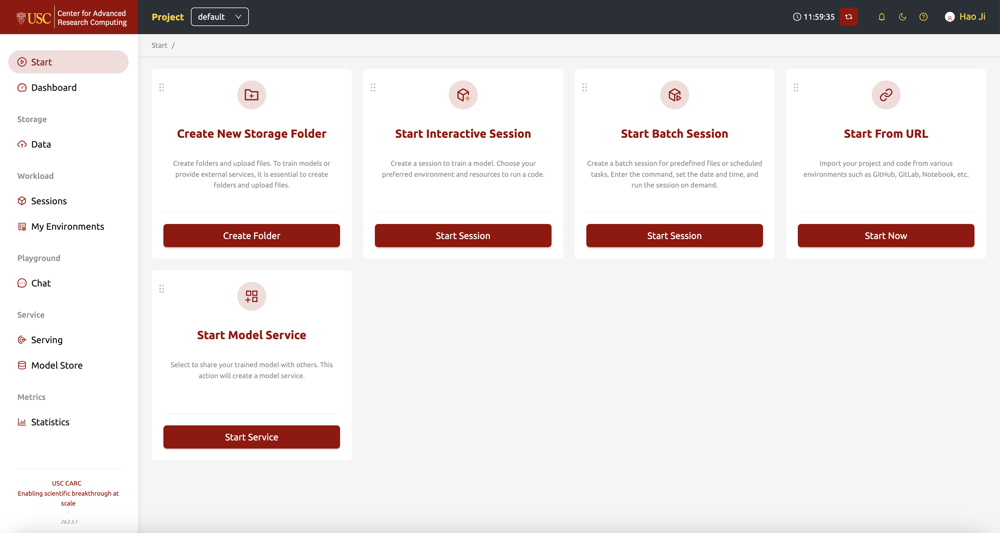

# Backend.AI Overview

Backend.AI is an open source cloud resource management platform, which makes it easy to utilize virtualized compute resource clusters in a cloud or on-premises environment. The container-based GPU virtualization technology of Backend.AI supports the efficient use of GPUs by flexibly dividing one physical GPU, so that multiple users can use it at the same time.

---

## Accessing the Portal & Authentication
To begin using the Backend.AI platform at USC, navigate to the following web address:

**Portal URL:** [https://backendai.carc.usc.edu/start](https://backendai.carc.usc.edu/start)

### Logging in with USC Credentials
For all USC users, it is recommended to use the **Single Sign-On (SSO)** method. This ensures you are authenticated through the university's secure system.

1. **Visit the Start Page**
   Go to [backendai.carc.usc.edu/start](https://backendai.carc.usc.edu/start).
   
2. **Select the USC Login Option**
   Instead of using the standard email/password fields, click the link labeled **LOGIN WITH USC** at the bottom of the card.

   

3. **USC Shibboleth Authentication**
   You will be redirected to the standard USC sign-in page. Enter your **USC NetID** and password, and complete the **Duo 2FA** prompt if requested.

4. **Redirection**
   Once verified, you will be automatically returned to the Backend.AI portal with your session active.

---

## The Start Page (Landing Page)
The **Start Page** is your primary entry point for launching tasks. It features quick-action cards to manage data and compute workloads.

### Quick Start Cards
* **Create New Storage Folder:** Initialize virtual folders and upload datasets.
* **Start Interactive Session:** Launch real-time environments like Jupyter Notebooks or VS Code.
* **Start Batch Session:** Queue background tasks for predefined scripts or long-running jobs.
* **Start From URL:** Import projects directly from GitHub, GitLab, or remote Notebooks.
* **Start Model Service:** Deploy trained models as API endpoints for inference.

---

## Navigation & UI
The interface is organized into logical functional areas via the sidebar and top bar.

### Navigation Sidebar
* **Start:** The quick-action launcher (current page).
* **Dashboard:** High-level overview of resource usage and active session counts.
* **Storage (Data):** Interface for managing virtual folders.
* **Workload (Sessions):** Monitor running tasks and custom container images.
* **Playground (Chat):** Interface for LLM interaction and experimental tools.
* **Service:** Tools for model deployment and the Model Store.

### Top Bar Features
* **Project Selector:** Toggle between different projects (e.g., "default") to manage quotas.
* **Session Timer:** Monitor system time and active runtimes.

---

## System Info (USC CARC)
* **Organization:** USC University of Southern California
* **Facility:** Center for Advanced Research Computing
* **Version:** 24.03.7

> ### Technical Note
> If you are unable to reach the login page, please verify that you are connected to the USC network or have the **USC VPN** active, as required by CARC security policies.
