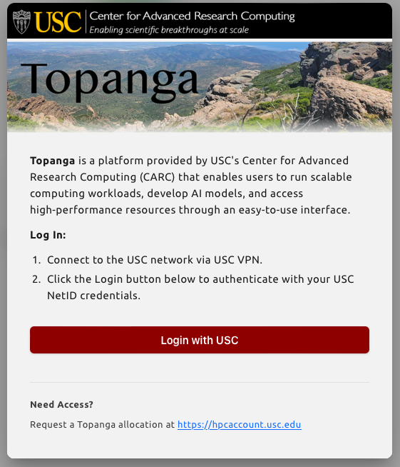

# Topanga Overview

Topanga is USC CARC’s pay-as-you-go computing service for running AI/ML, data science, and research workloads without managing your own servers. Through the Topanga web portal, you can launch tools like Jupyter, VS Code, RStudio, terminals, batch jobs, and model services, choose the CPU or GPU resources you need, and pay only for the time you use. Topanga is powered by Backend.AI, but most users can think of it as an easy way to access CARC-managed computing resources on demand.

---

## Key Topanga Features

Topanga supports common research workflows, from interactive exploration to larger AI and HPC jobs. It can share GPU resources efficiently, connect multiple compute containers for distributed training, provide different session types for notebooks, terminals, batch jobs, and model serving, and make project files available through persistent virtual folders. The sections below summarize these features in more detail.

### 1. Efficient GPU Sharing

Some research tasks only need part of a GPU. Topanga can split a physical NVIDIA GPU across multiple sessions with isolated memory and compute shares, helping more users run GPU workloads at the same time. This is useful for labs, classes, and exploratory work where a full GPU may not be necessary.

### 2. Distributed Training Sessions

Topanga supports multi-container sessions for distributed computing and training. Containers in a cluster session are automatically connected over a private network, with ready-to-use hostnames (`main1`, `sub1`, `sub2`, ...) and generated SSH access. From the main container, users can connect to a worker container with `ssh sub1` without manually exchanging keys or configuring firewall rules.

Two modes are available:

- **Single node:** All containers run on one compute node, using a local bridge network.
- **Multi-node:** Containers can run across multiple compute nodes, using an overlay network.

If a multi-node request can fit on a single compute node, Topanga keeps the containers together to reduce network latency. This setup is useful for frameworks such as PyTorch DDP, TensorFlow MultiWorker, Horovod, and MLflow.

### 3. Flexible Session Types

Topanga supports several ways to run your work:

- **Interactive sessions:** Launch tools such as Jupyter, VS Code, RStudio, or a terminal for live exploration and debugging.
- **Batch sessions:** Run longer jobs in the background, such as training runs, simulations, or data processing scripts.
- **Model services:** Deploy trained models as API endpoints for inference.

### 4. Persistent Storage with Virtual Folders

Topanga connects your sessions to persistent storage through **Virtual Folders (vFolders)**. These folders can be mounted into your compute sessions regardless of which compute node the session runs on, making it easier to reuse code, data, and results across sessions. Virtual folders also support sharing and per-user or per-project quotas.

## Request Topanga Allocations
Requesting Topanga Allocations can be done through CARC user portal: [https://hpcaccount.usc.edu](https://hpcaccount.usc.edu). 

---

## Accessing the Portal & Authentication

To start using Topanga at USC, go to:

**Portal URL:** [https://topanga.carc.usc.edu](https://topanga.carc.usc.edu)

### Logging in with USC Credentials

Before logging in, connect to the **USC VPN**. Some Topanga services are only accessible from the USC network, so the portal may not load properly without an active VPN connection. USC users should sign in with **Single Sign-On (SSO)** through USC Shibboleth.

1. **Visit the Start Page**
   Go to [https://topanga.carc.usc.edu](https://topanga.carc.usc.edu).

2. **Use USC Shibboleth Authentication**
   You will be redirected to the standard USC sign-in page. Enter your **USC NetID** and password, and complete the **Duo 2FA** prompt if requested.

3. **Open the Dashboard**
   After authentication, you will be directed to the **Dashboard**, which is the Start Page of the Topanga portal.

4. **Log Out**
   When you log out, you will be returned to the **Topanga login page**. To log back into the Dashboard, click the **Login with USC** button on the login card rather than using the standard email/password fields.

   

---

## The Start Page (Landing Page)

The **Start Page** is your primary entry point for launching tasks. It features quick-action cards to manage data and compute workloads.

### Quick Start Cards

- **Create New Storage Folder:** Create a persistent storage folder, also called a virtual folder or vFolder, that can be mounted into your compute sessions. You can upload code, datasets, notebooks, and results to this folder before starting a session, then access those files inside Jupyter, VS Code, RStudio, or a terminal as if they were on a local disk. Files in a storage folder remain available after a session ends. A storage folder can also expand your available storage and provide a faster storage option for your work. Creating a storage folder is optional, but it is recommended if you plan to reuse data or save results.

- **Start Interactive Session:** Launch a live computing environment for hands-on work. Interactive sessions are useful for exploring data, testing code, running notebooks, debugging scripts, or working in a terminal. Depending on the available environment, you can start tools such as Jupyter Notebook, VS Code, RStudio, or a shell terminal, choose the CPU/GPU resources you need, and mount your storage folders so your files are available during the session.

- **Start Batch Session:** Submit a script or job to run in the background. Batch sessions are useful for longer-running work such as model training, simulations, data preprocessing, or other tasks that do not require constant interaction. You can choose the environment and resources, mount any needed storage folders, and review logs or output files after the job starts or completes.

- **Start From URL:** Start a session from an existing project or notebook hosted online, such as a GitHub or GitLab repository. This is useful when you want to quickly work from shared code, course materials, example notebooks, or a research project repository without setting everything up manually from scratch.

- **Start Model Service:** Deploy a trained model as an inference service so it can receive requests and return predictions through an API endpoint. This is useful for testing, sharing, or running AI models after training. You can choose the model environment and compute resources needed for the service, then monitor and stop the service when it is no longer needed.

---

## Navigation and Interface

The interface is organized into main work areas in the sidebar and top bar.

### Navigation Sidebar

- **Start:** Open the quick-action launcher.
- **Dashboard:** View resource usage and active session counts.
- **Data (Storage):** Manage virtual folders, sharing, and quotas.
- **Sessions (Workload):** Monitor running tasks, view per-container logs, and access running apps.
- **My Environments:** Manage your custom container images.
- **Chat (Playground):** Use LLM interaction and experimental AI tools.
- **Serving:** Deploy and manage model inference endpoints.
- **Model Store:** Browse and publish reusable trained models.

### Top Bar Features

- **Project Selector:** Switch between projects, such as `default`, to manage project-specific quotas. A user can belong to multiple projects within a domain.
- **Session Timer:** Monitor system time and active runtimes.

---

## Key Concepts (Quick Reference)

| Concept | Meaning |
|---|---|
| **User** | A person logged into Topanga. Roles include normal user, domain admin, and superadmin. |
| **Domain** | A top-level resource boundary, such as an organization or affiliate group. |
| **Project** | A working unit inside a domain. Users can belong to multiple projects. |
| **Compute Session** | An isolated running workspace where your selected apps, code, and resources are available. |
| **Image** | A pre-built software environment with runtimes, tools, and ML frameworks. |
| **Virtual Folder (vFolder)** | A persistent storage folder that can be mounted into compute sessions. |
| **Application Service** | An app, such as Jupyter, VS Code, Terminal, or TensorBoard, launched inside a compute session. |

---

## System Info (USC CARC)

- **Organization:** University of Southern California (USC)
- **Facility:** Center for Advanced Research Computing

> ### Technical Note
> If you are unable to reach the login page, please verify that you are connected to the USC network or have the **USC VPN** active, as required by CARC security policies.

---

## Further Reading

- Official WebUI User Guide: <https://webui.docs.backend.ai/en/latest/index.html>
- Cluster Compute Sessions: <https://webui.docs.backend.ai/en/latest/cluster_session/cluster_session.html>
- Model Serving: <https://webui.docs.backend.ai/en/latest/model_serving/model_serving.html>
- Mounting vFolders: <https://webui.docs.backend.ai/en/latest/mount_vfolder/mount_vfolder.html>

