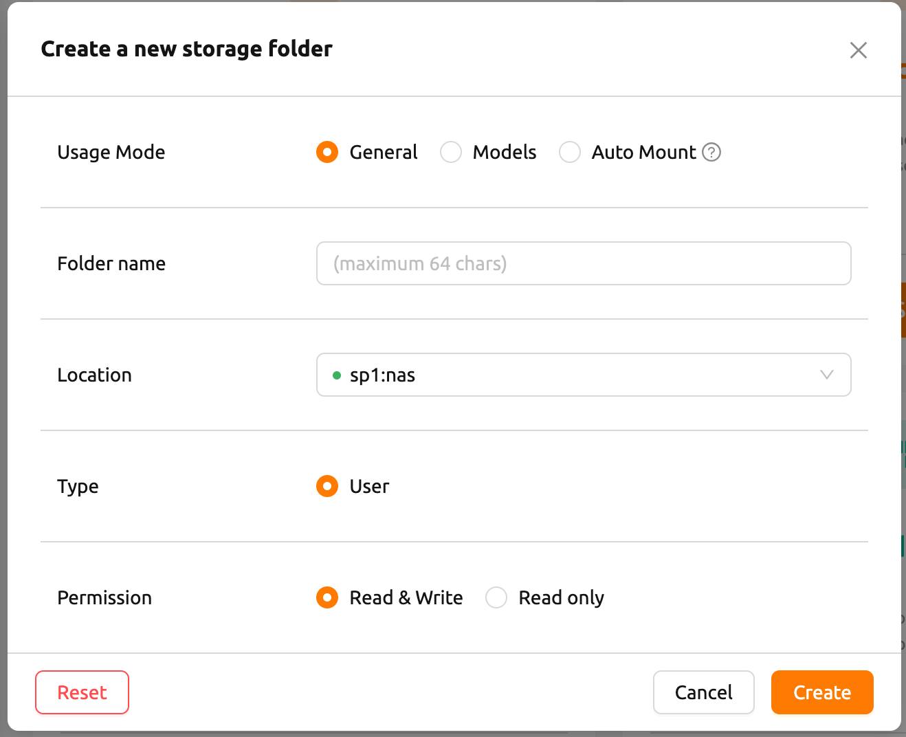
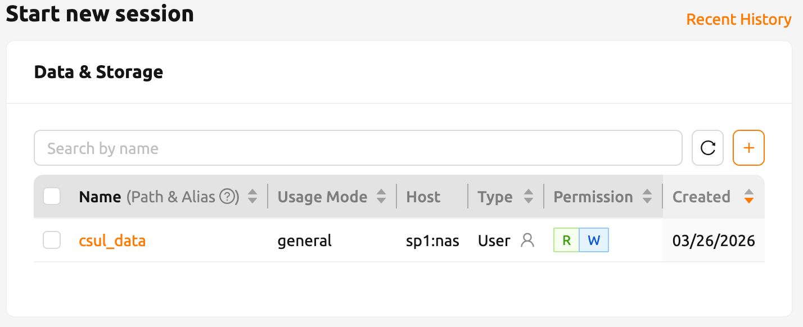

Cesar:
Objective: Instructions on data persistence and mounting file systems.

##  Managing Data (Virtual Folders)

Data in Virtual Folders is **persistent**, whereas files inside the container root are deleted after the session ends.

* **Upload:** Use the **Data** tab to upload datasets.
* **Share:** You can share folders with teammates for collaborative projects.

> **Important:** Always save your work in the mounted virtual folder paths (e.g., `/home/jovyan/work`) to ensure it isn't lost.

---

There are multiple places to store data on the Topanga system and can be categorized into 3 locations kinds:

* Session Specific
* Topanga Filesystem
* HPC Cluster filesystem

## Session Specific Data

| Path | Max Disk Capacity|
|---|---|
|`/home/work`|?? GB|

The "home" directory for every session is located at `/home/work`. Data here is temporarily stored on the Topanga filesystem and will be deleted when the session ends. **Do not store important or long-term data here.**

## Topanga Persistent Storage
| Path | Max Disk Capacity|
|---|---|
|`/home/folder_name`|1 TB|

For data storage that will be persistent across multiple sessions, create a *storage folder*. Cost is based on active storage so use when you need to temporarily store data between sessions. For longer term data storage, it may be more cost efficent to use the /project2 or /scratch1 [filesystems](#hpc-cluster-filesystem).

Because of limited capacity please keep usage **reasonable and proportional**. Users may be subject to **cleanup requests or per-user quotas**.

### Creating a storage folder
To create a storage folder using the backend.ai interface. 

The **Folder name** will determine the system path that the directory will be available at in each session.

**Usage Mode** refers to ....!

### Mounting a storage folder
The storage folder can be mounted during the session creation process. 

Under the 'Data & Storage' section, folders selected will be available during the session.
## HPC Cluster Filesystem
| Path | Max Disk Capacity|
|---|---|
|`/home/$USER`|100 GB|
|`/project2/$PI_NAME_PROJECT_ID`|Quota dependent|
|`/scratch2/$USER`|10 TB |

These system may offer:
* Larger capacity
* Better performance
* Project-level data sharing
