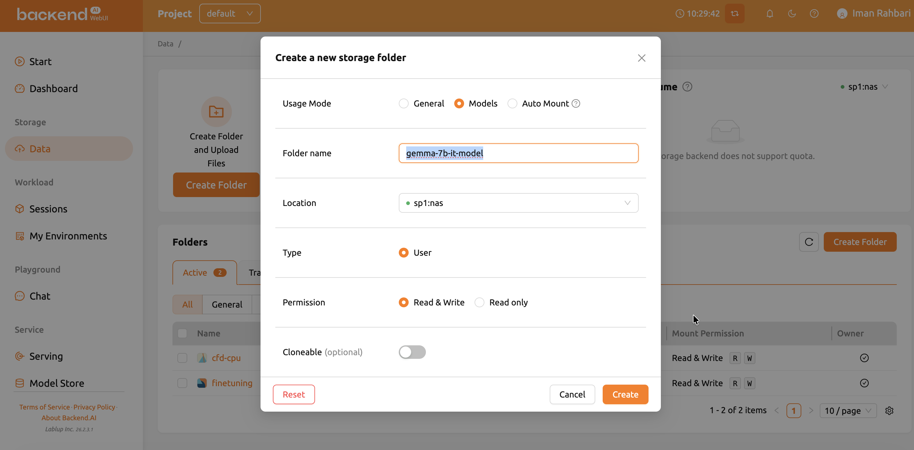

# Custom Inference

Backend.AI offers four inference runtime variants: **vLLM**, **NVIDIA NIM**, **Predefined Image Command**, and **Custom**. The first three start from a built-in launch command and only need a few env vars. Use **Custom** (the path used here) when you want full control via your own `model-definition.yaml` — for example, downloading the model on first start, picking specific vLLM flags, or running pre-start actions.

## Prerequisites

- A HuggingFace access token with permission to the model you plan to serve. For gated models like Gemma, you must also accept the license on HuggingFace first.
- A GPU resource preset large enough for the model. A 7B model in `bfloat16` needs ~16 GB GPU memory plus headroom for the KV cache; budget at least 1 full A100/H100 or equivalent.

## 1. Create an empty model storage folder

In **Data → Models**, create a new folder with usage type **Model**. Leave it empty for now. Both the YAML and the downloaded weights will live here.

> The folder must be created as a `model` folder (not `general`/`data`), otherwise it will not show up in the "Model Storage To Mount" picker on the Start Service form.



## 2. Create a `model-definition.yaml` file

This file tells Backend.AI how to start the inference container, which port to expose, and how to health-check it. Save it locally as `model-definition.yaml`:

```yaml
models:
  - name: "gemma-7b-it"
    model_path: "/models"
    service:
      start_command:
        - /bin/bash
        - -lc
        - >
          set -eo pipefail;
          MODEL_DIR=/models;
          MODEL_ID=google/gemma-7b-it;
          HF_TOKEN_VALUE="$(printenv HF_TOKEN || true)";
          if [ -z "$HF_TOKEN_VALUE" ]; then
            echo "HF_TOKEN is not set";
            exit 1;
          fi;
          if [ ! -f "$MODEL_DIR/config.json" ]; then
            echo "Downloading $MODEL_ID into $MODEL_DIR ...";
            if command -v hf >/dev/null 2>&1; then
              hf download "$MODEL_ID" --local-dir "$MODEL_DIR" --token "$HF_TOKEN_VALUE";
            else
              huggingface-cli download --local-dir "$MODEL_DIR" --token "$HF_TOKEN_VALUE" "$MODEL_ID";
            fi;
          else
            echo "Model already present in $MODEL_DIR, skipping download.";
          fi;
          exec vllm serve "$MODEL_DIR"
          --host 0.0.0.0
          --port 8000
          --served-model-name gemma-7b-it
          --dtype bfloat16
          --max-model-len 4096
          --generation-config vllm
      port: 8000
      health_check:
        path: /v1/models
        max_retries: 500
```

What each field does:

- `name` — the model identifier inside Backend.AI. Match this to `--served-model-name` so the same string works in API calls.
- `model_path` — where the model folder is mounted inside the container. `/models` is the Backend.AI default.
- `service.start_command` — the process the container runs. Here it (1) checks for `HF_TOKEN`, (2) downloads weights to `/models` on first start (idempotent — re-uses the cache on restart), and (3) execs `vllm serve` with an OpenAI-compatible API on port 8000.
- `service.port` — the container port the service listens on. Backend.AI's AppProxy maps this to the public endpoint.
- `service.health_check.path` — endpoint the proxy polls. `/v1/models` is reliable for vLLM because it only returns 200 once the model is fully loaded.
- `service.health_check.max_retries` — `500` is intentionally high to tolerate slow first-time HuggingFace downloads (multi-GB weights). Lower it to ~20 once weights are cached.

Other useful health-check options (defaults shown):
- `interval: 10.0` — seconds between checks.
- `max_wait_time: 15.0` — per-check HTTP timeout.
- `expected_status_code: 200`.
- `initial_delay: 60.0` — wait after container start before first check. Bump this to `300.0` for 70B+ models.

## 3. Upload the `model-definition.yaml`

Open the model folder you just created and upload the YAML at the root.


## 4. Go to **Serving** and click **Start Service**


## 5. Fill out the service form

Key fields to set:

- **Service Name** — any identifier (used in URLs and logs).
- **Open To Public** — leave **off** for token-protected access (recommended). When off, you'll generate an API token after launch.
- **Inference Runtime Variant** — choose **Custom** so Backend.AI uses your `model-definition.yaml`.
- **Model Storage To Mount** — pick the folder you created in step 1.
- **Model Definition File Path** — `model-definition.yaml` (default).
- **Number of Replicas** — `1` for a single GPU; increase only if you have the resources and need throughput.
- **Environment / Version** — pick a vLLM-capable image (one that ships `vllm` and `huggingface-cli`/`hf`).
- **Resource Allocation** — assign at least 1 GPU. For Gemma-7B in bf16 with `max-model-len 4096`, 1× A100 (40 GB) is a safe minimum.
- **Environment Variables** — add `HF_TOKEN=<your_hf_token>`. This is read by the `start_command` to authenticate the download.


Click **Create** at the bottom.

> Tip: there's a **Validate** button on the launcher that runs the start command in a test container and shows the log. Use it once before going live to catch YAML syntax errors or missing env vars early.

## 6. Wait for the service to become healthy

After creation you'll be redirected to the service detail page.


Status flow:

- **DEGRADED** — initial state during `initial_delay`. Model is loading; no traffic is routed yet. First-run downloads (multi-GB weights) can keep you here for several minutes.
- **HEALTHY** — `/v1/models` returned 200 within the timeout. The endpoint is now serving traffic.
- **UNHEALTHY** — too many consecutive failed health checks. Common causes: insufficient GPU/RAM, malformed `model-definition.yaml`, missing `HF_TOKEN`, or HuggingFace gating. Open the routing's container log to see why. Fix and click **Clear Error and Retry**.

Time-to-UNHEALTHY at startup with defaults is `initial_delay + interval × (max_retries + 1)`. With `max_retries: 500` and `interval: 10s` you get ~83 minutes of grace, which is what you want for a first-time download.

## 7. Session view

While the service runs you can see its kernel under **Sessions**.


## 8. Built-in chat

In the left column menu, under "Playground",click **Chat** to open the WebUI's chat against your endpoint.

Select the "serving service" from the dropdown menu and then choose the model you want to use and then you will be able to chat with the model.


## 9. Calling the API directly

Get the public endpoint from the routing info (port `10601` at USC CARC is Backend.AI's AppProxy port). If "Open to Public" is off, click **Generate Token**, set an expiration, and copy the token.


```bash
export API_TOKEN="<your_backend_ai_token>"

curl -H "Content-Type: application/json" \
     -H "Authorization: BackendAI $API_TOKEN" \
     https://backendai.carc.usc.edu:10601/v1/chat/completions \
     -d '{
       "model": "gemma-7b-it",
       "messages": [{"role": "user", "content": "Hello, who are you?"}],
       "max_tokens": 100
     }'
```

The `model` field must match `--served-model-name` from your `start_command` (here, `gemma-7b-it`).


Because vLLM exposes the OpenAI-compatible API, you can also point the official OpenAI Python SDK at the same URL by setting `base_url` to `https://backendai.carc.usc.edu:10601/v1` and using `BackendAI $API_TOKEN` as the bearer.

## Troubleshooting

- **Stuck in DEGRADED forever.** Open the container log. Likely an OOM during model load, a missing/invalid `HF_TOKEN`, or you forgot to accept the model license on HuggingFace.
- **`HF_TOKEN is not set` in logs.** You forgot to add `HF_TOKEN` under Environment Variables on the Start Service form.
- **Health check failing on `/v1/models`.** vLLM hasn't finished loading. Either raise `initial_delay` and `max_retries`, or use `/health` instead — note that `/health` returns 200 earlier in vLLM's startup, before the model is ready.
- **API call returns 401/403.** Token expired or wrong header. The header is `Authorization: BackendAI <token>` — note the literal word `BackendAI`, not `Bearer`.

## Cleanup

When you're done, terminate the service from the **Serving** tab. Idle services keep replicas alive and consume GPU quota.
