# Running Jobs on Backend.AI

Compute sessions are the unit of work on Backend.AI: a container running on the cluster with the environment, resources, and storage you request. This guide walks through launching a session, working inside it (Jupyter, terminal, logs), and managing it through its lifetime.

## Starting a new session

After logging in, click **Sessions** in the left sidebar and then click **START** in the upper right. The session launcher opens as a multi-step wizard. You can move through the steps with **Next**, jump to a step from the right-hand menu, or click **Skip to review** to accept defaults for the remaining steps.

### 1. Session type

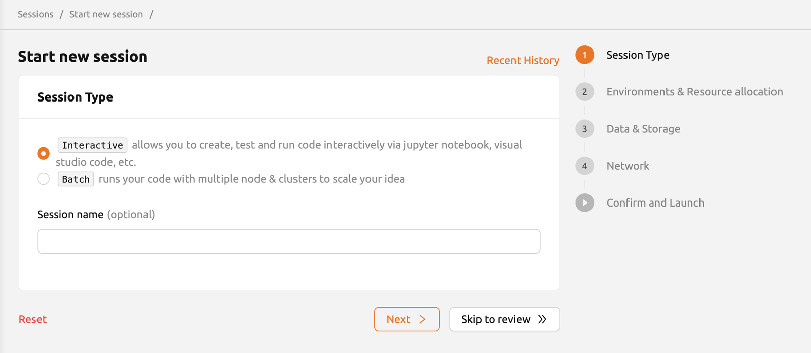

Pick one of three user-facing session types:

* **Interactive** — the default. The session stays alive until you destroy it (or until an admin-configured idle check terminates it). Use this for development, notebooks, and any work where you drive the session in real time.
* **Batch** — define a startup script that runs as soon as the container is ready. The session terminates automatically when the script finishes. You can also set a **start time** (the session will not run before then, but is not guaranteed to start exactly at that time) and a **timeout duration** that force-terminates the session.
* **Inference** — for serving models with persistent endpoints, auto-scaling, and automatic recovery. Requires a model definition file.

> A fourth type, **System**, exists for internal operations (for example, sFTP uploads) and is managed automatically — you will not create it directly.

The optional **Session name** field accepts 4–64 alphanumeric characters with no spaces. If you leave it blank, Backend.AI assigns a random name.

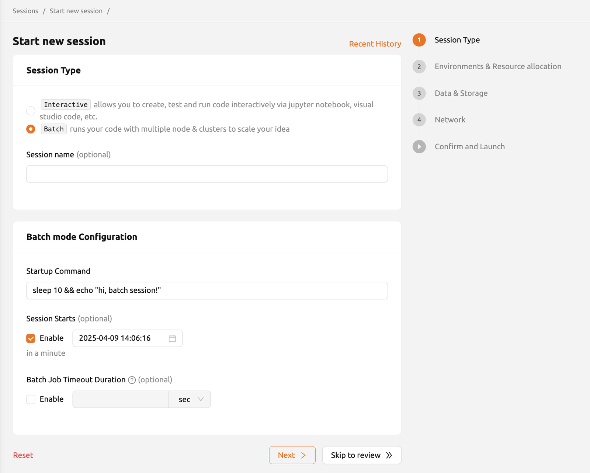

### 2. Environments & resource allocation

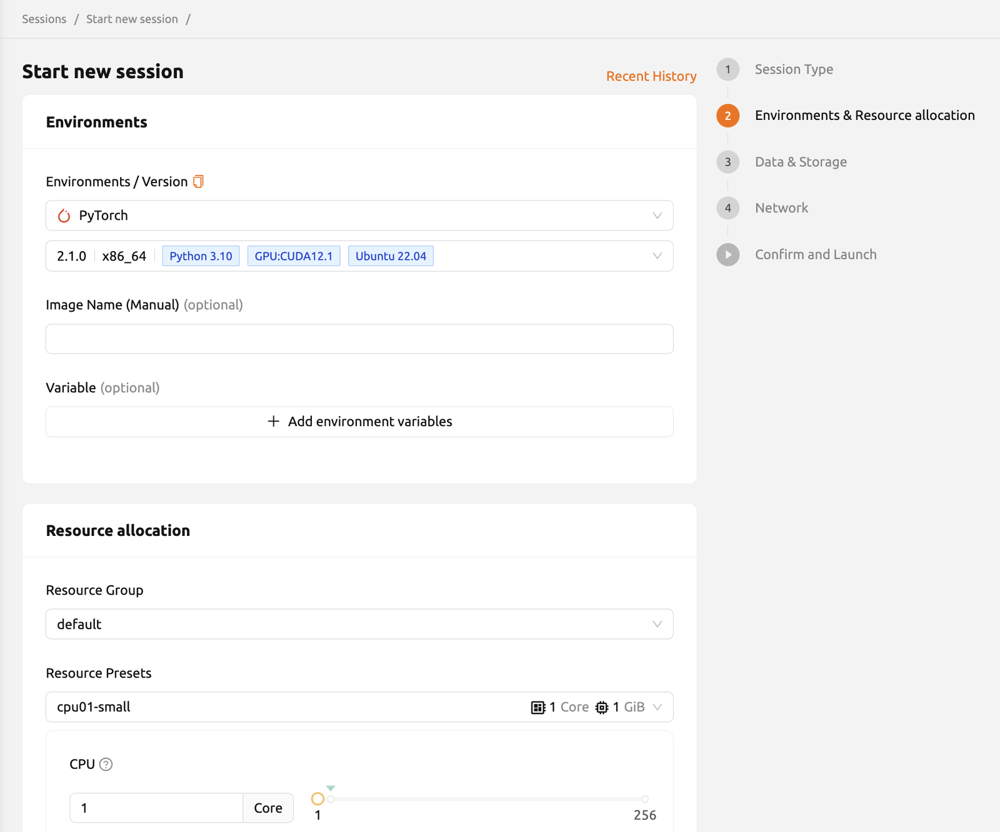

**Environment** is the base image — for example, PyTorch, TensorFlow, or a plain Python/C++ image. Pick the **Version** (e.g. TensorFlow 2.3 vs 1.15) and, if available, override the **Image Name** directly. You can also set **environment variables** (such as `PATH`) here; see the [environment variables](#adding-environment-variables) section below.

Under **Resource allocation** you choose how much hardware the session gets:

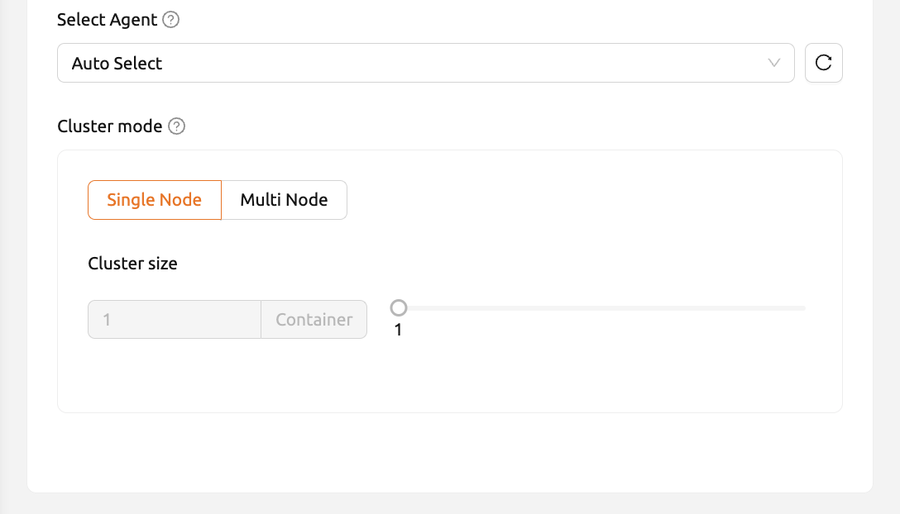

* **Resource Group** — the pool of host servers your session can run on. Servers in a group typically share the same GPU type. If you have access to more than one group, pick whichever fits your workload.
* **Resource Presets** — predefined CPU / memory / GPU bundles. Sliders let you fine-tune CPU cores, RAM, shared memory, AI accelerators (GPUs/NPUs), and the number of sessions to launch in parallel.
* **Sessions** — set above 1 to launch multiple identical sessions at once. Requests that cannot fit are queued.
* **Select Agent** — by default the scheduler picks the agent. You can override this for single-node, single-container sessions.
* **Cluster mode** — for multi-node distributed sessions.

> When using a GPU, allocate at least **2× the GPU memory in RAM**. Anything less and the GPU will spend significant time idle waiting for the host.

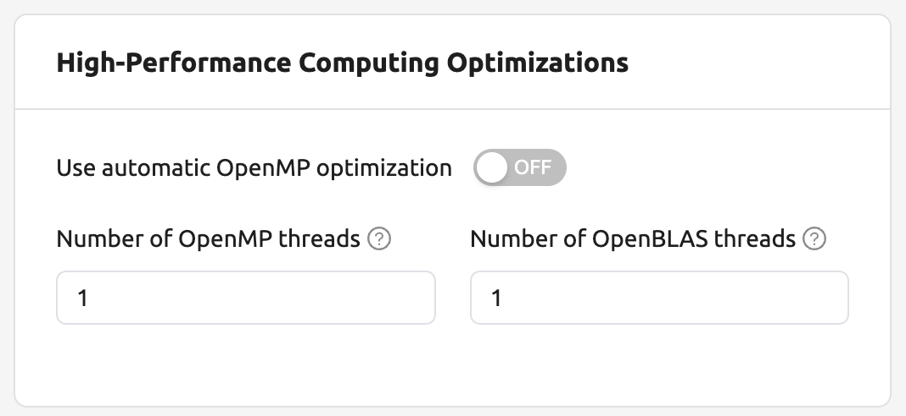

The **High-Performance Computing Optimizations** section exposes the `nthreads-var` control. By default Backend.AI sets it equal to the session's CPU count, which speeds up typical HPC workloads. For multi-process OpenMP workloads that already spawn many threads, lowering this to `1` or `2` avoids oversubscription and the slowdown that comes with it.

### 3. Data & storage

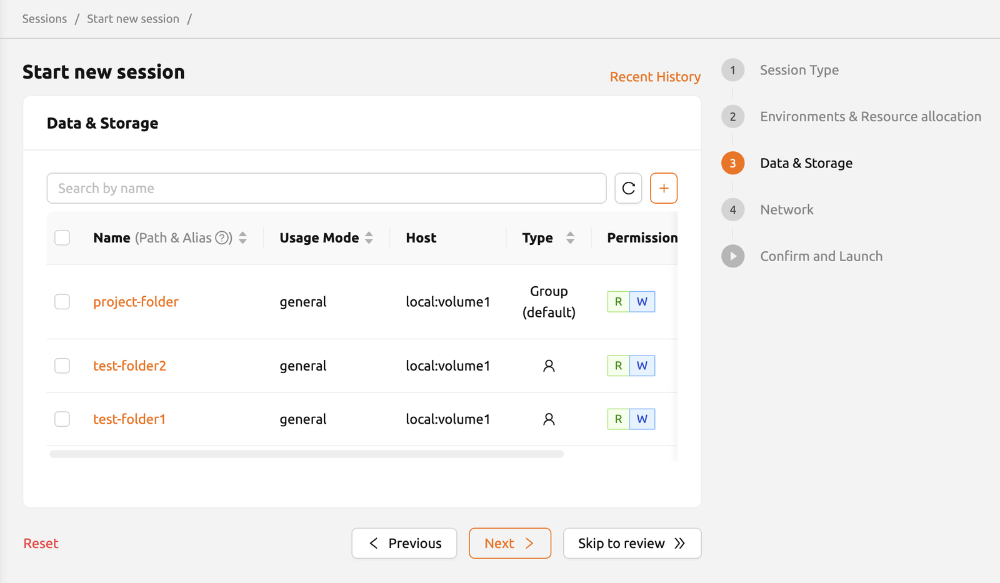

Select the storage folders to mount inside the container. Anything outside a mounted folder is wiped when the session ends, so put data you want to keep into a mounted folder. You can create a new folder right here with the **+** button next to the search box; it will be auto-selected for mounting. For more on storage folders, see [Data Management](Data%20Management.md).

### 4. Network

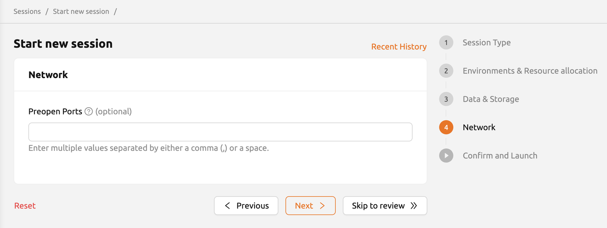

Use this step to declare **preopen ports** — internal container ports that should be exposed at startup so you can run a custom server (web service, API, dashboard) without rebuilding the image. See [adding preopen ports](#adding-preopen-ports) below for the details.

### 5. Confirm and launch

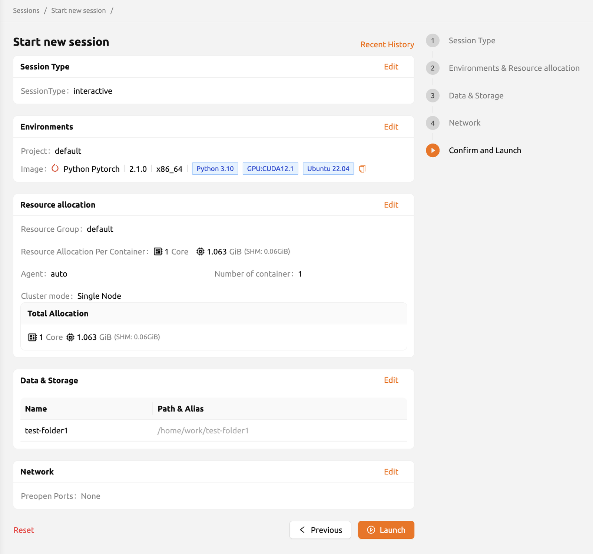

The final step is a summary of every setting: image, resources, mounts, environment variables, preopen ports. Use the **Edit** icon on any card to jump back to that step. If something is wrong, an error card appears and you can fix it before launching.

Click **Launch**. If you did not mount any folders a warning dialog appears — click **Start** to proceed anyway. A notification appears in the bottom-right of the screen when the session starts:

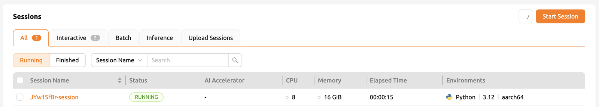

## Working in the environment

Once the session is **RUNNING**, click its name in the session list to open the **Session Detail Panel**, which shows the session ID, type, environment, mounts, allocated resources, elapsed time, agent, cluster mode, network I/O, and per-kernel info.

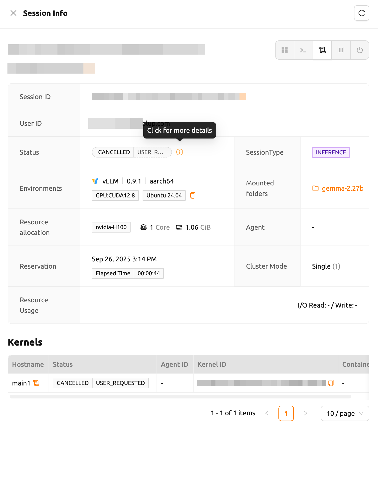

The icons in the top-right of the detail panel are how you actually use the session. The first icon opens the **app launcher**:

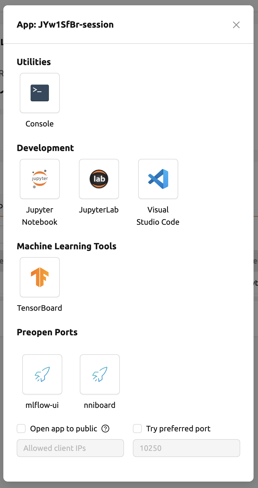

Two checkboxes apply to whichever app you open next:

* **Open app to public** — by default web apps (Terminal, Jupyter, etc.) require your authentication. Check this and anyone with the URL and port can access it.
* **Try preferred port** — without this, Backend.AI assigns a random port from its pool. With it, Backend.AI tries the port you enter first and falls back to a random one if that port is unavailable.

### Jupyter Notebook

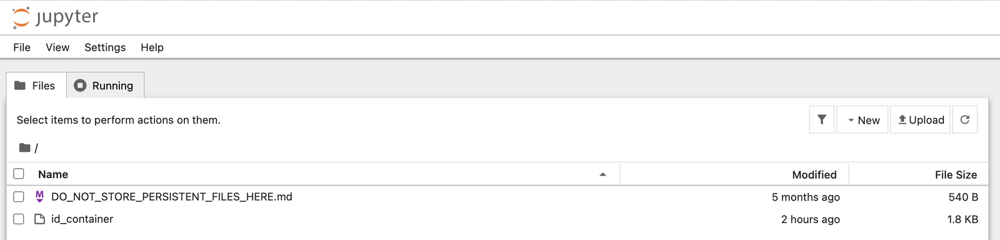

Click the Jupyter icon to open a notebook in a new tab. The container's libraries are already available, so no extra `pip install` is needed for whatever the base image provides. Click **NEW → Notebook** to create an `.ipynb` file. Files created this way live in `/home/work` and are deleted when the session ends — save anything you need into a mounted folder. See [Data Management](Data%20Management.md) for how mounted folders persist.

> The notebook file explorer also contains an `id_container` file with a private SSH key. Download it if you want to SSH/SFTP into the container from your laptop.

### Web terminal

Click the terminal icon (`>_`, second icon) to open a shell in a new tab. See [Shell Access](Shell%20Access.md) for the basics. Files you create here are visible in Jupyter and vice versa — they are the same filesystem.

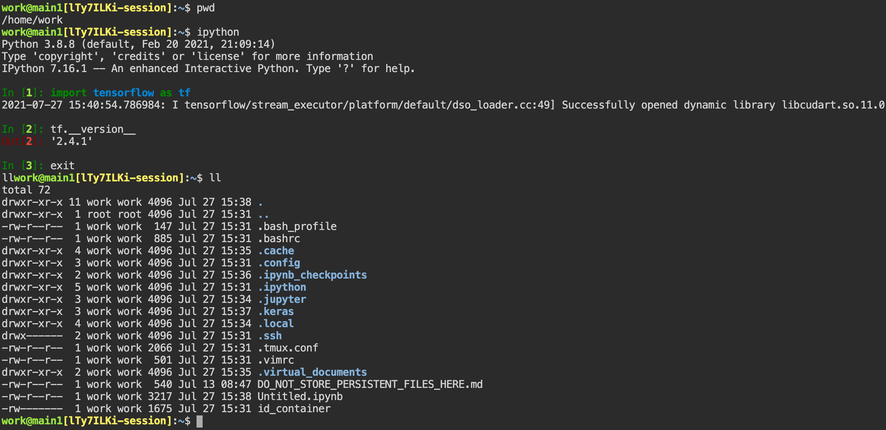

The terminal embeds **tmux**, so a few shortcuts are useful:

* `Ctrl-B c` — open a new shell pane
* `Ctrl-B w` — list and switch between open shells
* `Ctrl-B x` then `y` — close the current shell
* `Ctrl-B :` then `set -g mouse off` — turn off tmux mouse mode so you can copy text to your system clipboard with `Ctrl-C` / `Cmd-C`. Re-enable it with `set -g mouse on` to restore mouse-wheel scrolling.

### Session logs

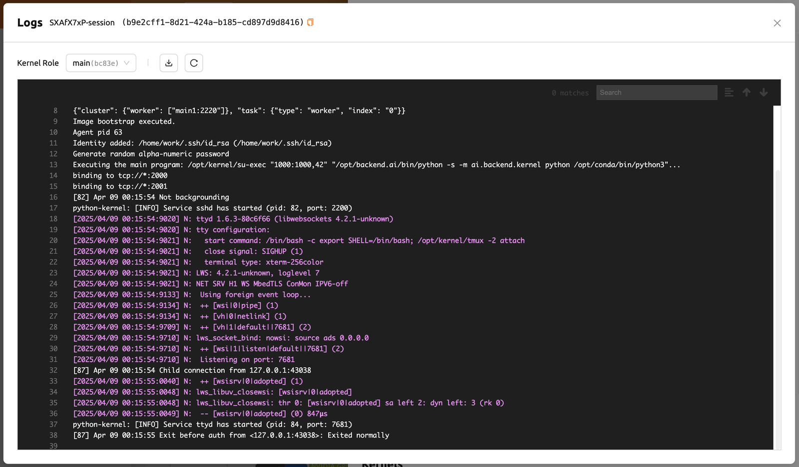

The log icon in the control panel opens the kernel log. Useful when a session is misbehaving or a batch script failed. You can also click **Log** next to a kernel hostname inside the detail panel to view that specific kernel's log.

## Managing a running session

### Rename

Click **Edit** in the session detail panel to rename. The new name follows the same 4–64 alphanumeric rule as the original.

### Idle checks

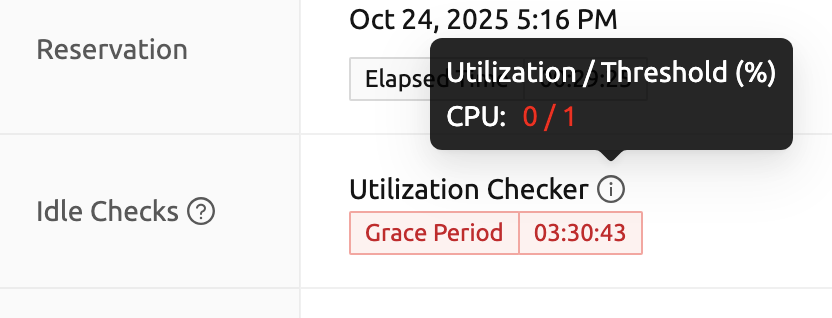

Backend.AI can auto-terminate sessions to reclaim resources. Three checkers may be active:

* **Max Session Lifetime** — hard cap on session age, regardless of what it is doing.
* **Network Idle Timeout** — terminates sessions with no user-to-container traffic for a set period. Background jobs alone do not count as activity; you need real user interaction (typing in the terminal, running cells, etc.).
* **Utilization Checker** — once a **grace period** ends, the session is eligible for termination if average resource utilization stays below a threshold for the idle window. Hovering the checker shows current vs threshold; the color goes yellow then red as you approach termination.

The idle window only looks at the **average** over the last idle timeout, so briefly using the GPU does not extend the grace period.

### Terminate

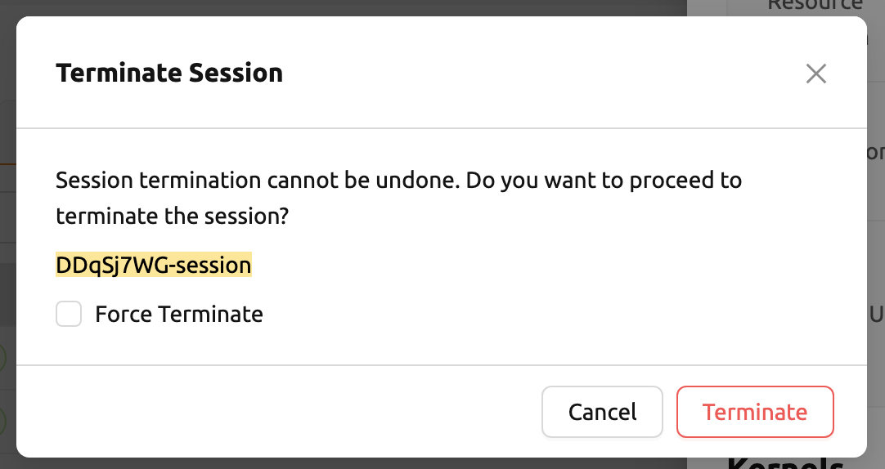

Click the red power button on the session row and confirm with **Terminate**. Anything outside a mounted folder is gone the moment the session ends, so move/copy what you need first.

## Advanced features

### Adding environment variables

On the **Environments** step, click **+ Add environment variables** and fill in the name/value pair (one row per variable). Use the **−** button to remove a row. Variables are exported into the shell of every kernel in the session.

### Adding preopen ports

On the **Network** step, type one or more port numbers between **1024 and 65535**, separated by commas or spaces, then press **Enter**. The configured ports show up later in the app launcher. Note that these are the **internal container ports** — clicking them in the app launcher opens a blank page until you actually bind a server to that port inside the container.

### Convert a session to an image (commit)

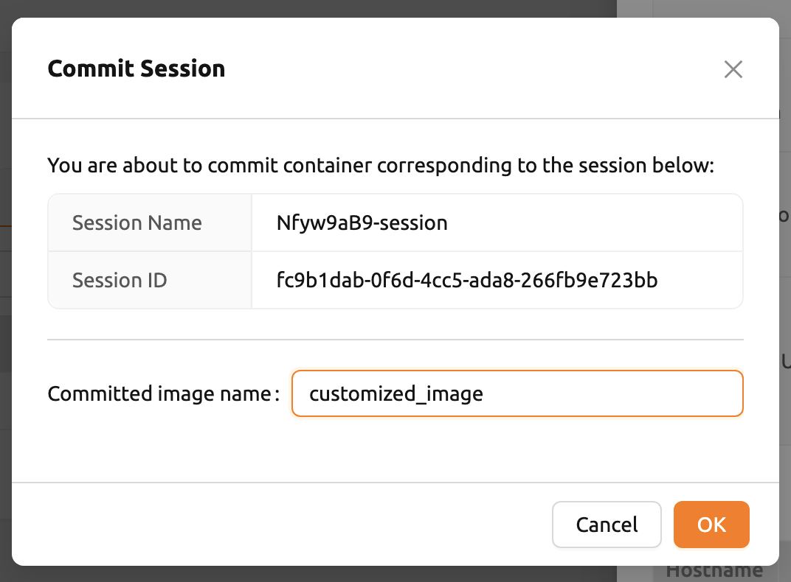

The **Commit** icon (fourth icon in the detail panel) saves the current state of a **RUNNING** interactive session as a new image. Enter an image name (4–32 chars, alphanumeric / `-` / `_`) and click **PUSH SESSION TO CUSTOMIZED IMAGE**. The new image shows up as `Customized<session name>` in the environment list when you launch future sessions, and is private to you.

A few caveats:

* Only **interactive** sessions can be committed.
* Mounted folders are external resources and are **not** included in the image — and `/home/work` is itself a scratch mount, so anything there is also excluded.
* Your resource policy may cap the number of customized images. Delete an old one and retry, or contact an admin.
* Avoid terminating the session while a commit is in progress; if you have to, force-terminate it.

## Additional resources

* [Backend.AI Compute Sessions documentation](https://webui.docs.backend.ai/en/latest/sessions_all/sessions_all.html) — the upstream source for this guide.
* [Data Management](Data%20Management.md) — storage folders, persistence, and mounting.
* [Shell Access](Shell%20Access.md) — using the web terminal.
* [Software-modules](Software-modules.md) — loading software inside a session with Lmod.
