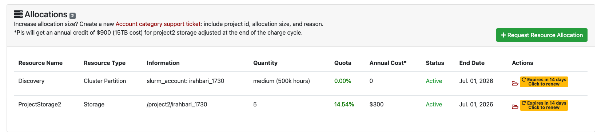

# Request Topanga Allocation

Topanga allocations are requested from the CARC User Portal, not from the Topanga dashboard. Topanga is a separate **Cloud** allocation type for Backend.AI/Topanga cloud computing resources.

An active Topanga allocation gives a CARC project access to launch Topanga sessions and sets the project's cloud computing limits, quota, status, and end date.

Before requesting an allocation, make sure your PI has an active CARC project and the annual project review is complete. If the portal asks you to complete a project review, finish that step before continuing.

## 1. Allocation Type

For Topanga, request the **Topanga Previous Service (Cloud)** resource in the CARC User Portal.

- **Topanga Previous Service (Cloud)**: Provides access to Backend.AI/Topanga cloud computing resources for AI/ML, data science, research computing, notebooks, terminals, batch sessions, GPU sessions, and model services.

After approval, the allocation should appear in the project's allocation table with **Resource Type** listed as **Cloud**.

## 2. Requesting a Topanga Allocation

1. Go to the CARC User Portal: [https://hpcaccount.usc.edu](https://hpcaccount.usc.edu).
2. Sign in with your USC NetID and complete Duo if prompted.
3. Select the project that should receive Topanga access.
4. On the Project Detail page, find the **Allocations** table.
5. Click the green **Request Resource Allocation** button.
6. Choose **Topanga Previous Service (Cloud)** from the resource menu.
7. Enter the requested quantity or allocation size, if the form asks for one.
8. Add a justification explaining why the project needs Topanga access.
9. Submit the request.

The screenshot below shows where to find the green request button. Existing rows in the allocation table are examples only; for Topanga, request the **Topanga Previous Service (Cloud)** resource.



Your justification should briefly include:

- Project ID and PI name
- Research group, class, or user group that will use Topanga
- Expected workload, such as Jupyter notebooks, GPU training, batch jobs, model serving, or class exercises
- Expected CPU, GPU, memory, runtime, and concurrent session needs
- Start date, deadline, or renewal reason, if relevant

If **Topanga Previous Service (Cloud)** is not available in the resource menu, submit a CARC support ticket under the **Account** category and ask for Topanga cloud allocation access for the project. Include the project ID, PI, users who need access, requested allocation size, and reason for the request.

## 3. Allocation Status

After submission, the allocation appears in the project's allocation table.

- **New**: The request has been submitted and is waiting for CARC review.
- **Active**: CARC has approved the request and the project can use Topanga.
- **Expiring**: The allocation is close to its end date. Use the renewal action in the allocation table if the project still needs Topanga access.
- **Ended** or **inactive**: The allocation is no longer available. Renew it or submit a new request if the project still needs access.

The allocation table shows the resource name, resource type, information, quantity, quota usage, annual cost if applicable, status, end date, and available actions.

## 4. Renewing a Topanga Allocation

When an allocation is near its end date, the Project Detail page may show a yellow renewal label such as **Expires in ... Click to renew**.

1. Open the project in the CARC User Portal.
2. In the **Allocations** table, find the **Topanga Previous Service (Cloud)** allocation.
3. Click the renewal action.
4. Confirm the requested allocation size and update the justification if the project scope has changed.
5. Submit the renewal before the end date.

## 5. After Approval

Once the allocation status is **Active**, open the Topanga portal:

[https://topanga.carc.usc.edu](https://topanga.carc.usc.edu)

Connect to the USC network or VPN if needed, sign in with USC SSO, and make sure the correct project is selected in Topanga. You should then be able to create sessions and use the cloud computing resources covered by your allocation.

If the allocation is active in the CARC User Portal but you still cannot use it in Topanga, log out and back in, check that you selected the correct project, and contact CARC support if the quota still does not appear.

## 6. Example Request Text

```text
Project ID:
PI:
Resource requested: Topanga Previous Service (Cloud)
Requested quantity or allocation size:
Users or course:
Workload description:
Expected CPU, GPU, memory, runtime, and concurrent session needs:
Requested start date or renewal date:
Reason:
```

## Further Reading

- [CARC User Portal](https://hpcaccount.usc.edu)
- [CARC Allocation Types and Requests](https://www.carc.usc.edu/user-guides/project-and-allocation-management/allocation-types-and-requests.html)
- [Topanga portal](https://topanga.carc.usc.edu)
