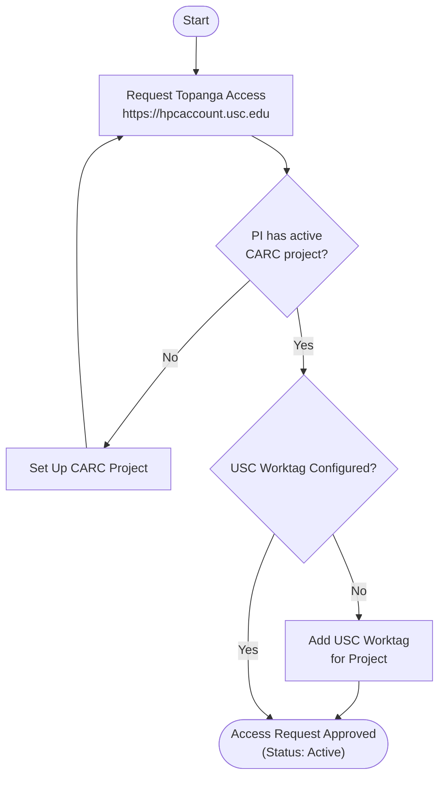

# Topanga Set Up Process

## Steps

1. **Request Topanga Access** via the CARC User Portal ([https://hpcaccount.usc.edu](https://hpcaccount.usc.edu)).
2. Confirm the **PI has an active CARC project** — if not, set one up and re-submit the request.
3. Confirm the **USC work tag** is configured for your project — if not, add it.
4. Once both checks pass, the **Access Request is Approved**.
