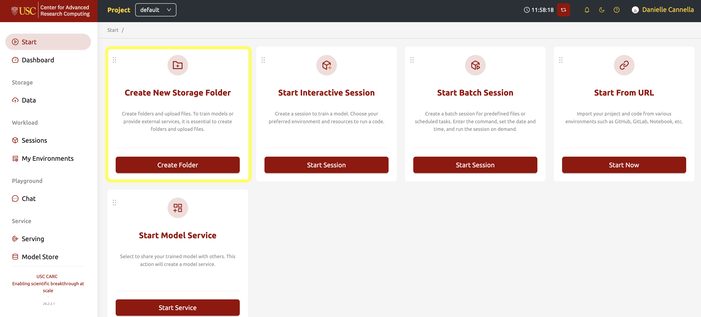
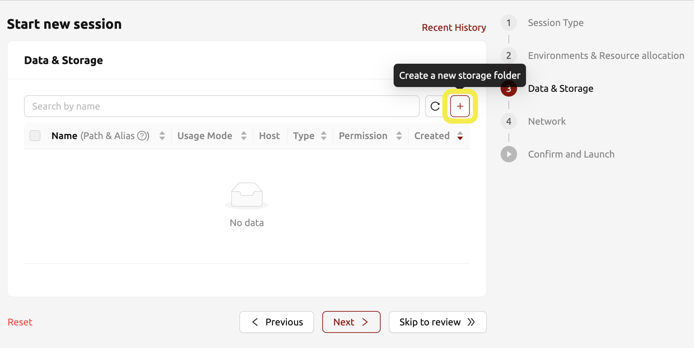

# Data Management

There are 3 locations to store data on the Topanga AI Computing system:

* Session specific directories
* Topanga file system
* CARC shared file systems

## Session specific data

| Path | Max Disk Capacity|
|---|---|
|`/home/work`|50 GB|

The home directory for every session is located at `/home/work`. This is your desktop environment's default folder, used for cache files, temporary downloads, and logs. Data here is temporarily stored on the Topanga filesystem and will be deleted when the session ends. **Do not store important or long-term data here.**

## Topanga Persistent Storage

| Path | Max Disk Capacity|
|---|---|
|`/home/your-folder_name`|1 TB|

For data storage that will be persistent across multiple sessions, create a storage folder under `/home/your-folder-name`. These folders are best used for code repositories, datasets, trained models (model.h5, checkpoint.pt). Persistent storage a **fee-based** service for when you need to temporarily store data between sessions. For long term data storage or larger data sets, it is more cost effective to use the /project2 or /scratch1 file systems (see [HPC cluster file systems](#hpc-cluster-file-systems)).

Because of limited capacity, please keep usage **reasonable and proportional**. Users may be subject to **cleanup requests or per-user quotas**.

### Creating a storage folder

Storage folders can be created from the Start page or during a new session initiation.

Both methods will prompt a pop-up window where you can set the usage mode, enter a folder name, and set permissions.

**Usage Mode** sets the purpose of the folder:
* **General**: The default, general-purpose definition.
* **Models**: Defines a folder specialized for model serving and management. If this mode is selected, the option to make the folder cloneable becomes available.
* **Auto Mount**: Sets the folder to automatically mount when a session is created. If selected, the folder name *must* start with a dot ('.').

### Mounting a storage folder

Storage folders are mounted during the session creation process. If a storage folder already exists before creating a session, it will appear automatically in the list of available folders in the **Data & Storage** section of the session creation. If the folder is created during the sessions, it will show up as available and automatically selected for mounting to your new session.

## CARC shared file systems

| Path | Max Disk Capacity | Best for | Notes |
|---|---|---|---|
|`/home/$USER`|100 GB| Personal files, configuration files, scripts, and smaller code repositories | Persistent user home storage. Use this for lightweight files rather than large training datasets. |
|`/project2/$PI_NAME_PROJECT_ID`|Quota dependent| Shared project or lab data, training datasets, checkpoints, and collaboration files | Recommended for project-owned data that multiple users or jobs may need to access. |
|`/scratch2/$USER`|10 TB | Temporary job output, intermediate files, and active training runs | Intended for scratch data rather than long-term storage. Move important results to `/project2` or another persistent location when the job finishes. |

These systems offer:
* Larger capacity
* Better performance
* Project-level data sharing

## Persistent Storage with Virtual Folders

Topanga connects your sessions to persistent storage through **Virtual Folders (vFolders)**. These folders can be mounted into your compute sessions regardless of which compute node the session runs on, making it easier to reuse code, data, and results across sessions. Virtual folders also support sharing and per-user or per-project quotas.