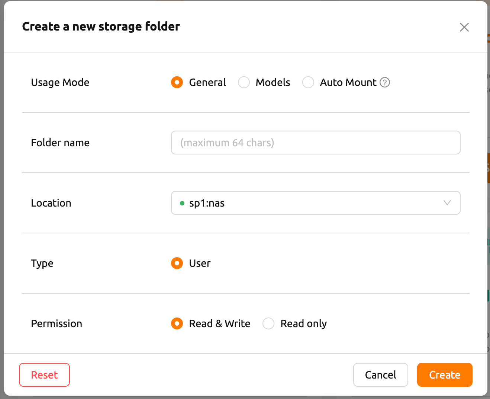
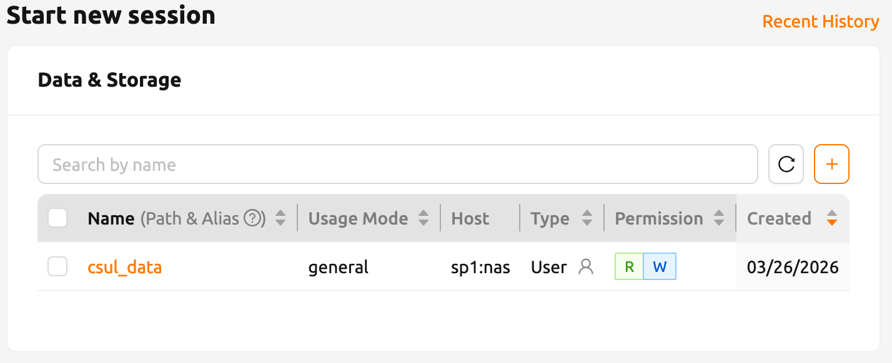
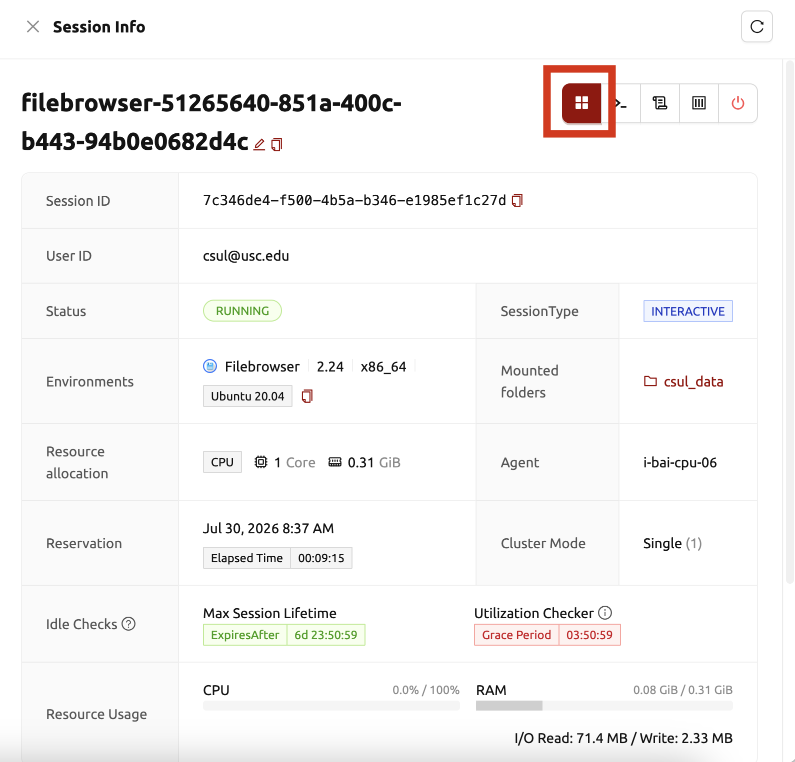
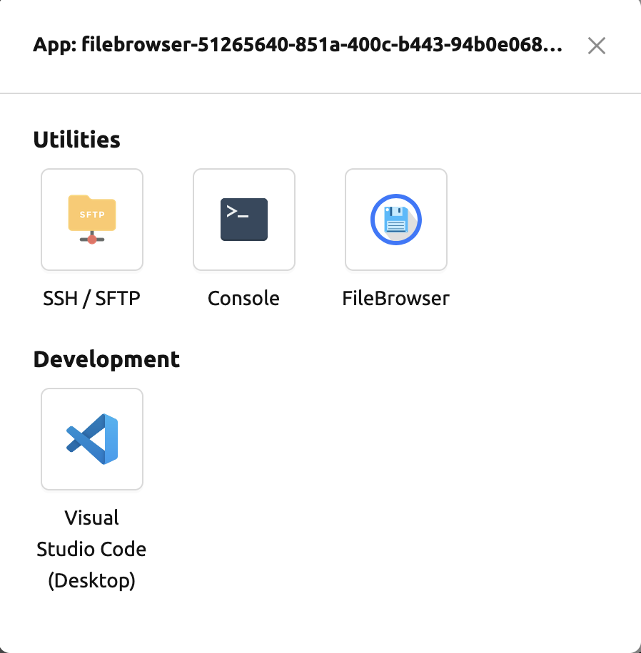
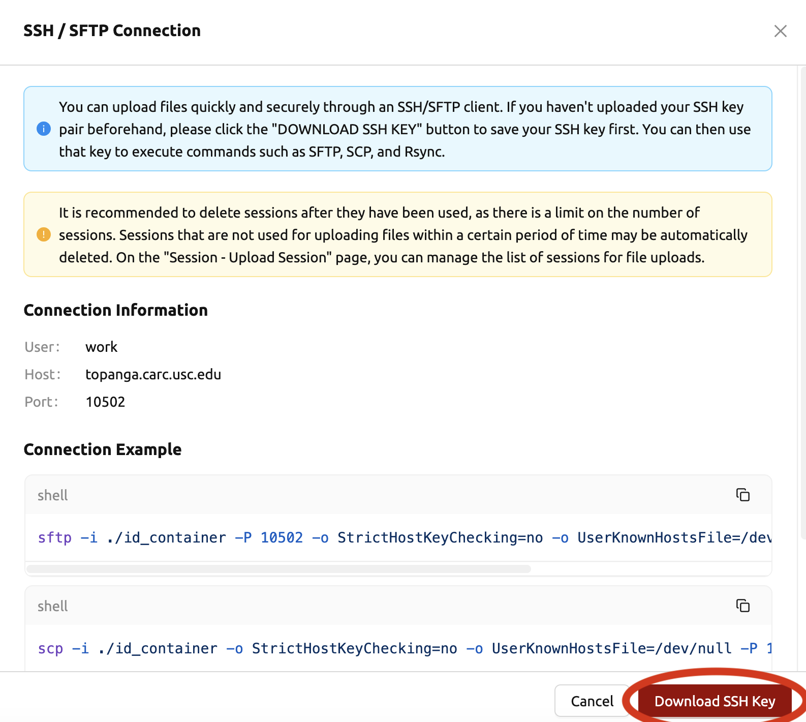
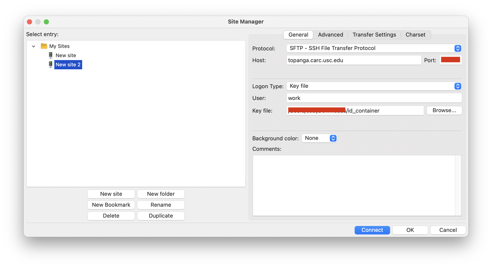
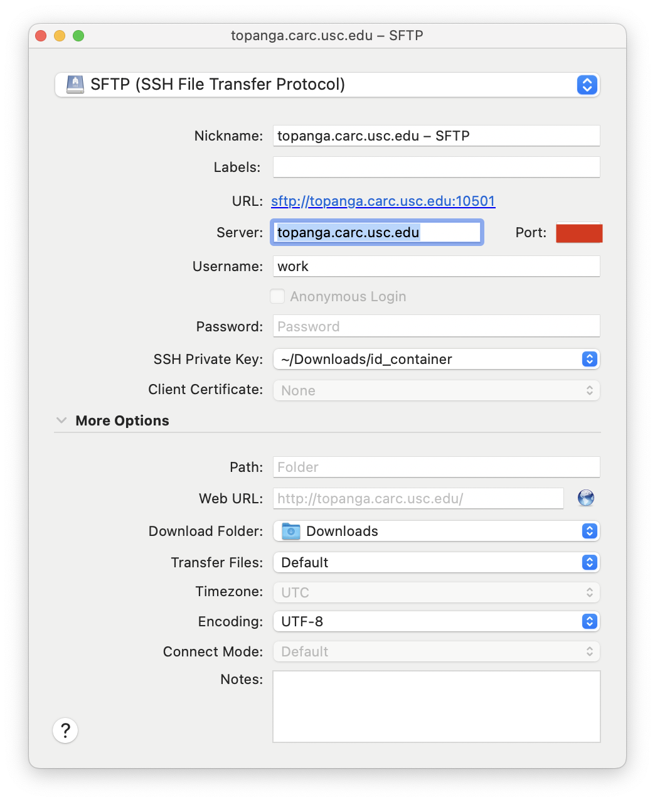

# Data Management

There are multiple places to store data on the Topanga system that can be categorized into 3 types:

* Topanga persistent storage
* Session specific
* HPC cluster file systems

Files can be downloaded from an interactive app to your laptop:
Download: Use the App's "Download" button (in Jupyter file explorer).

## Topanga persistent storage
| Path | Max Disk Capacity|
|---|---|
|`/home/folder_name`|1 TB|

Persistent storage folders can be mounted into your compute sessions regardless of which compute node the session runs on, making it easier to reuse code, data, and results across sessions. The persistent storage system also supports sharing and per-user or per-project quotas. Persistent storage has a quota of 1 TB per PI. You can create several directories as long as the total size fits within 1 TB. It is best used for code repositories, datasets, and trained models (model.h5, checkpoint.pt).

There is no cost for storage as long the PI can stay under the 1TB quota. For longer term or higher capacity data storage, it may be more cost efficient to use the /project2 or /scratch1 [filesystems](#hpc-cluster-filesystem).

Users may be subject to **cleanup requests or per-user quotas**.

### Creating a persistent storage folder

Persistent storage folders can be created from the Topanga dashboard or during session creation. 



**Usage Mode** defines the purpose of the folder:
* *General*: Defines a folder for storing various data in a general-purpose manner.
* *Models*: Defines a folder specialized for model serving and management. If this mode is selected, it is also possible to toggle the folder's copy availability.
* *Auto Mount*: Folders automatically mounted when a session is created. If selected, the folder name must start with a dot ('.').

The **folder name** will determine the system path that the directory will be available at in each session.

### Mounting a storage folder

An existing storage folder can be mounted during the session creation process. Under the 'Data & Storage' section, there will be a list of available folders to choose from.



## Session specific data

| Path | Max Disk Capacity|
|---|---|
|`/home/work`|50 GB|

The /home directory is your desktop environment's default folder for every session and is located at `/home/work`. Data here is temporarily stored on the Topanga file system and will be deleted when the session ends. **Do not store important or long-term data here.** `/home/work` is best used for cache files, temporary downloads, and logs.

## HPC cluster file systems
| Path | Max Disk Capacity|
|---|---|
|`/home/$USER`|100 GB|
|`/project2/$PI_NAME_PROJECT_ID`|Quota dependent|
|`/scratch2/$USER`|10 TB |

These systems are automatically mounted in your Topanga sessions and offer:
* Larger capacity
* Better performance
* Project-level data sharing

## Uploading data to Topanga

You can use the web browser UI to transfer a small numbers of files into your Topanga directories. For larger datasets, uploading data through the command line or SFTP client is supported with a few extra steps.

### Download SSH Key

You will need an SSH Key for each unique session. To create one, first create a file browser session and open up the session info when it starts.



Select **See App Dialog** and then select **SSH/SFTP**.



On the bottom right, select **Download SSH Key**. You should then see a file named `id_container`.



### Connecting to your SFTP Session

On the SSH/SFTP App Dialog Menu you will get information about what Username, Host, and port number to use to connect. Unless otherwise directed, the defaults are:

| Host| User| Port|
|---|---|---|
|topanga.carc.usc.edu|work| Unique per session|

#### FileZilla

Open the Site Manager and fill in the Host and Port information provided by the SSH/SFTP Dialog Menu. The path to your `id_container` SSH Key may vary. 



#### Cyberduck

Create a new Bookmark and fill in the Host and Port information provided by the SSH/SFTP Dialog Menu. The path to your `id_container` SSH Key may vary. 



#### Command line:

For those familiar with `sftp` it's possible to manage files through the command line but you will need a few extra steps. If not already set, you will need to set proper permissions on the ssh key:

```
chmod 600 ./id_container
```

Since the host configuration you are connecting to will vary with each session, disable `StrictHostKeyChecking` and `UserKnownHostsFile`. You will also need to supply the port number provided by the SSH/SFTP App Dialog Menu:

```
sftp -i ./id_container -P $PORT_NUMBER -o StrictHostKeyChecking=no -o UserKnownHostsFile=/dev/null work@topanga.carc.usc.edu
```


