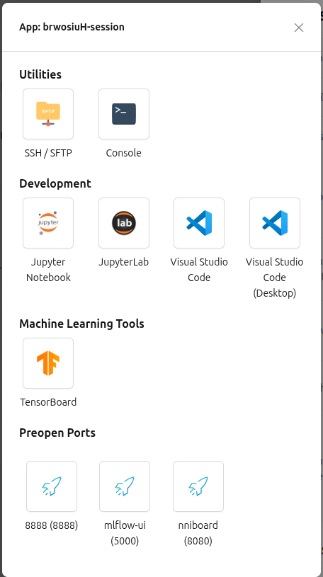

# Running Jobs and Apps on Topanga AI Computing

Compute sessions&mdash;a container running on the cluster with the environment, resources, and storage you request&mdash; are how you conduct work on Topanga AI Computing. Topanga allows you to launch a sessions, utilize useful tools (terminal, logs), run jobs, use interactive apps (JupyterLab, tVisual Studio Code, RStudio), and manage data.

## Starting a new session

After logging in, select **Sessions** in the left sidebar menu and then select either of the **Start Session** buttons on the screen. The session launcher opens as a multi-step wizard.


### Session type

Pick one of three session types:

* **Interactive** — This is the default session type. The session stays alive until you terminate it (or until an admin-configured idle check terminates it). Use this for development, notebooks, and any work where you drive the session in real time.


* **Batch** — Use this session type to define a startup script that runs as soon as the container is ready. The session terminates automatically when the script finishes. You can also set a **start time** (the session will not run before then, but is not guaranteed to start exactly at that time) and a **timeout duration** that force-terminates the session.
    * If using this option to launch a script, under "Startup Command" use `bash` to launch, as in:


    ``` bash /path/to/script.sh```


* **Inference** — Use this for serving models with persistent endpoints, auto-scaling, and automatic recovery. This session requires a model definition file. Instructions for setting up and managing a custom inference can be found [here](https://github.com/uschpc/USC-BackendAI-Testing-Docs/blob/main/inference-service.md)

The optional **Session name** field accepts 4–64 alphanumeric characters with no spaces. If you leave it blank, Backend.AI assigns a random name. Sessions can be renamed later.

### Environments & resource allocation

**Environment** is the base image&mdash;for example, PyTorch, vLLM, or custom images. Pick the environment you need from the dropdown menu.


For each environment, you can select the **Version** (e.g. PyTorch 2.10 vs 2.8). 


You can also set **environment variables** (such as `PATH`, or `HF_TOKEN` for Hugging Face) here, if needed. Select **+ Add environment variables** and fill in the name/value pair (one row per variable). Use the **−** button to remove a row. Variables are exported into the shell of every kernel in the session.


Under **Resource allocation** you choose the specifications for you session:

* **Resource Group** — the pool of host servers your session can run on. Choose the CPU group if you do not require and GPUs for your workload.

* **Resource Presets** — predefined CPU, memory, and (optionally) GPU bundles. Shared memory can be adjusted up or down based on your workload.

* **Sessions** — allows you to launch up to 3 identical sessions at once. Requests that cannot fit are queued.

* **Cluster mode** — You can also use this platform to launch distributed sessions in a cluster. This will use the high-bandwidth network between the agents. The connections between the 2 nodes are automatically established and you do not need to use an SSH key to connect to the other nodes.

> When using a GPU, allocate at least **2× the GPU memory in RAM**. Anything less and the GPU will spend significant time idle waiting for the host.

The **High-Performance Computing Optimizations** section exposes the `nthreads-var` control. By default Topanga sets it equal to the session's CPU count, which speeds up typical HPC workloads.

### Data & storage

Select the storage folders to mount inside the container. Anything outside a mounted folder is wiped when the session ends, so store data you want to keep into a mounted folder. 

You can create a new folder right here with the **+** button next to the search box; it will be auto-selected for mounting. For more on storage folders, see [Data Management](data-management.md). You can also mount the storage folders that you have already created and it will show up in `/home/work/<storage_folder_name>`


### Network

Use this optional step to declare **preopen ports**&mdash;internal container ports that should be exposed at startup so you can run a custom server (web service, API, dashboard) without rebuilding the image.


If required, type one or more port numbers between **1024 and 65535**, separated by commas or spaces, then press **Enter**. The configured ports show up later in the app launcher. Note that these are the **internal container ports**. Clicking them in the app launcher opens a blank page until you bind a server to that port inside the container.

### Confirm and launch

Review your settings before launching the session. Use the **Edit** link on any section to jump back to that step. If something is wrong, an error card appears and you can fix it before launching.

Once confirmed, select **Launch** at the bottom. If you did not mount any folders a warning dialog appears. You can select **Start** to proceed anyway, but note that all files saved in `/home/work` will be deleted when the session ends. You need to mount your `/home1` or `/project2` or `/scratch1` directories to save your data.

A notification appears in the bottom-right of the screen when the session successfully starts.

## Managing a session

Once the session is **RUNNING**, click its name in the session list to open the **Session Info panel**, which shows the session ID, type, environment, mounts, allocated resources, elapsed time, agent, cluster mode, network I/O, and per-kernel info. Use the icons at the top right of the panel to interact with your session.


* **App dialogue**: The first icon (four squares) opens an application menu where you can access various [interactive apps](#interactive-apps), tools, and utilities.


* **Web terminal**: The console icon (`>_`) opens a shell in a new tab. See [Shell Access](Shell%20Access.md) for more information.

    The terminal embeds **tmux**&mdash;here are some useful commands:

    * `Ctrl-B c`: open a new shell
    * `Ctrl-B w`: list and switch between open shells
    * `Ctrl-B x` then `y`: close the current shell
    * `Ctrl-B :` then `set -g mouse off`: turn off tmux mouse mode so you can copy text to your system clipboard with `Ctrl-C` / `Cmd-C`. Re-enable it with `set -g mouse on` to restore mouse-wheel scrolling.
* **Container logs**: The third icon in the session panel opens the kernel log. This is useful for troubleshooting a session or investigating a failed batch script. You can also click **Log** next to a kernel hostname inside the detail panel to view that specific kernel's log.

    

* **Container commit**: The fourth icon saves the current state of a **RUNNING** interactive session as a new image. Enter an image name (4–32 chars, alphanumeric / `-` / `_`) and select **OK**. The new image shows up as `Customized<session name>` in the environment list when you launch future sessions. Images are private to you.

    

    Please note:

    * Only **interactive** sessions can be committed.
    * Mounted folders are external resources and are **not** included in the image — and `/home/work` is itself a scratch mount, so anything there is also excluded.
    * Your resource policy may cap the number of customized images. Delete an old one and retry, or contact an admin.
    * Avoid terminating the session while a commit is in progress; if you have to, force-terminate it.

* **Terminate**: Select the red power button to end your session. Sessions can also be terminated from the Sessions dashboard by selecting the checkbox to the left of the session name and then selecting the red power symbol with a slash through it. Anything outside a mounted folder is deleted the moment the session ends, so move/copy any important data first.

<!--
Pausing the Session
Action: Clicking "Pause" in the Session dashboard.
Result: The container is frozen.
Compute Cost: Reduced cost (resources released from active compute, but state kept).
App Access: Apps become inaccessible until you resume the session.

Within the terminal app:

- You will see a shell prompt (e.g., `work@main1[gDz6uH2p-session]:~$`).
- You can:
  - Run Linux shell commands (`ls`, `cd`, `python`, etc.)
  - Create and manage files
  - Install software

Closing the terminal browser tab does not stop the command that is running or the compute session.
-->

## Idle checks

Topanga can auto-terminate sessions to reclaim resources. Three checkers may be active:

* **Max Session Lifetime** — hard cap on session age, regardless of what it is doing.
* **Network Idle Timeout** — terminates sessions with no user-to-container traffic for a set period. Background jobs alone do not count as activity; you need real user interaction (typing in the terminal, running cells, etc.).
* **Utilization Checker** — once a **grace period** ends, the session is eligible for termination if average resource utilization stays below a threshold for the idle window. Hovering the checker shows current vs threshold; the color goes yellow then red as you approach termination.

The idle window only looks at the **average** over the last idle timeout, so briefly using the GPU does not extend the grace period.


## Interactive apps

Interactive app&mdash;such as JupyterLab, Visual Studio Code, or RStudio&mdash;area web-based interfaces that run inside your interactive compute session and are securely exposed to your browser. They transforms a raw container into a familiar, productive workspace.

Select your desired session in the session list to open the **Session Detail Panel**. The first icon in the top right of the panel (four squares) opens an application menu where you can access various interactive apps, tools, and utilities.



Selecting the app you want will open it in a new browser tab. There is a file explorer panel on the left of the app for easy access to your directories. See [Data Management](data%20management.md) for more information on managing data and directories.

### Example workflow

Here is an example workflow using JupyterLab:

1. In the file explorer panel, select your project's directory.
2. Create a new notebook or script in that directory.
3. Execute your code.
4. In the file explorer panel, select the circular arrow to refresh the panel in the app. Ensure your file(s) is visible inside `/home/work`.
5. Stop your session.
6. Your notebook file persists in the cache, ready for the next session.

Use Git to push code to a remote repository (GitHub/GitLab) from within the app terminal.

### Jupyter Notebook

Click the Jupyter icon to open a notebook in a new tab. The container's libraries are already available, so no extra `pip install` is required. Click **NEW → Notebook** to create an `.ipynb` file. Files created this way live in `/home/work` and are deleted when the session ends. Save important data that you don't want to lose into a mounted folder. See  on mounted folders.


> The notebook file explorer also contains an `id_container` file with a private SSH key. Download it if you want to SSH/SFTP into the container from your laptop.

### Stopping the App

Close the interactive app browser tab to stop the app. Your code, loaded variables, and model state remain in RAM. You can reconnect later exactly where you left off. Stopping an interactive app does not end the session&mdash;the session continues running on the backend and continues accruing fees.

Terminated the session will delete the entire container and stop any running apps.

### Advanced features

#### Port Forwarding (Service Apps)

If you need to expose a custom web service (like a local Flask or Streamlit app) inside your app:

1. Install the web service app inside your session (e.g., `pip install streamlit`).
2. Run the web service app locally inside the interactive app terminal (e.g., `streamlit run app.py --server.port 8501`).
3. Open the **Apps** tab in the Backend.ai dashboard.
4. Manually add port 8501 to the list of exposed ports.
5. Click the new link to view your Streamlit app in the browser securely.

#### Multiple Users, One App

If you use a Team vFolder, multiple members can launch sessions with that folder attached. Topanga ensures file locking and prevents corruption.However, do not share one single session between two people simultaneously.

<!--
Data Check: Did I save my notebook to /home/work/storage?
Connection Check: Did I Pause the session, or did I just close the browser tab? (Pause to save money/state).
Security Check: Did I clear my terminal history? (Run history -c or check .bash_history).
Resource Check: Did I accidentally leave a GPU-intensive session running while sleeping?
Summary
Interactive Apps on Backend.ai bridge the gap between powerful cloud infrastructure and your daily workflow. By mastering the distinction between the Session (the hardware state) and the App (the interface), you gain the ability to develop securely, save persistently, and scale efficiently.
-->

## Additional resources

* [Backend.AI Compute Sessions documentation](https://webui.docs.backend.ai/en/latest/sessions_all/sessions_all.html)
* [Data Management](Data%20Management.md)
* [Shell Access](Shell%20Access.md)
* [Software-modules](Software-modules.md)
