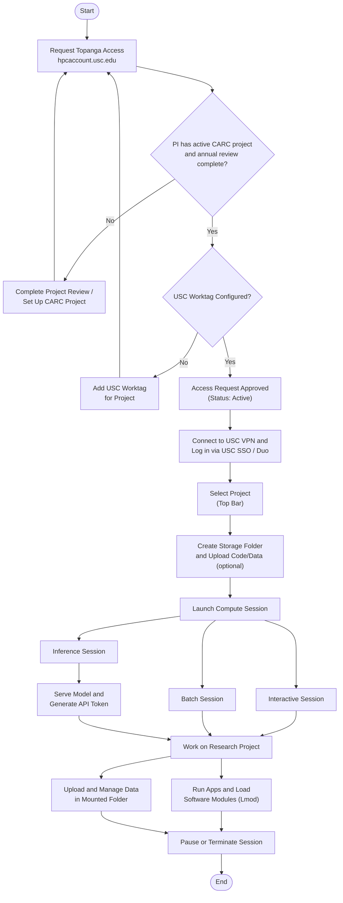

# Topanga Quick Start Guide

## Steps

1. **Request Topanga Access** via the CARC User Portal ([hpcaccount.usc.edu](https://hpcaccount.usc.edu)).
2. Confirm the **PI has an active CARC project** and the **annual project review is complete** — required before a request can be approved.
3. **Add a USC work tag** to your project if it isn't already configured — also required for approval.
4. Once approved, **connect to the USC VPN** and **log in via USC SSO / Duo** at [topanga.carc.usc.edu](https://topanga.carc.usc.edu).
5. **Select your project** in the top bar.
6. Optionally **create a storage folder** and upload code/data ahead of time.
7. **Launch a compute session**: Interactive, Batch, or Inference.
   - Inference sessions additionally require creating a model-definition file and generating an API token before serving traffic.
8. **Work on your research project** — run applications, load software modules (Lmod), and upload/manage data in your mounted storage folder.
9. **Pause or terminate the session** when finished to manage cost and preserve state appropriately.
