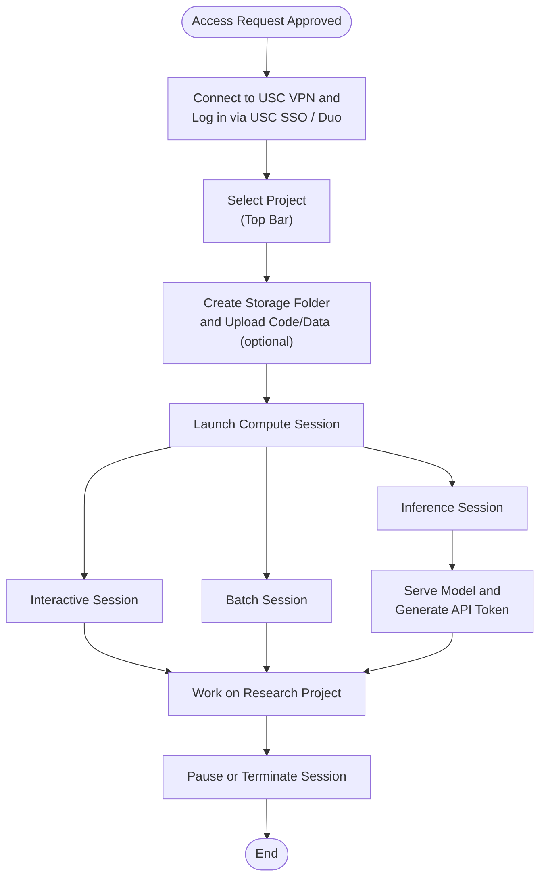

# Topanga Usage Process

## Steps

1. Once access is approved, **connect to the USC VPN** (if off-campus) and **log in via USC SSO / Duo** at [topanga.carc.usc.edu](https://topanga.carc.usc.edu). See [Getting Started with Topanga](https://github.com/uschpc/USC-BackendAI-Testing-Docs/blob/main/getting-started-topanga.md).
2. **Select your project** in the top bar.
3. Optionally **create a storage folder** and upload code/data ahead of time. See [Data Management](https://github.com/uschpc/USC-BackendAI-Testing-Docs/blob/main/data-management.md).
4. **Launch a compute session**: Interactive, Batch, or Inference. See [Running Jobs and Apps](https://github.com/uschpc/USC-BackendAI-Testing-Docs/blob/main/running-jobs-and-apps.md).
   - Inference sessions additionally require **serving the model and generating an API token**. See [Inference Service](https://github.com/uschpc/USC-BackendAI-Testing-Docs/blob/main/Inference-Service.md).
5. **Work on your research project**. See [Software Modules](https://github.com/uschpc/USC-BackendAI-Testing-Docs/blob/main/software-modules.md), [Running Jobs and Apps](https://github.com/uschpc/USC-BackendAI-Testing-Docs/blob/main/running-jobs-and-apps.md), [MPI and Multinode](https://github.com/uschpc/USC-BackendAI-Testing-Docs/blob/main/mpi-and-multinode.md).
6. **Pause or terminate the session** when finished to manage cost and preserve state appropriately.
