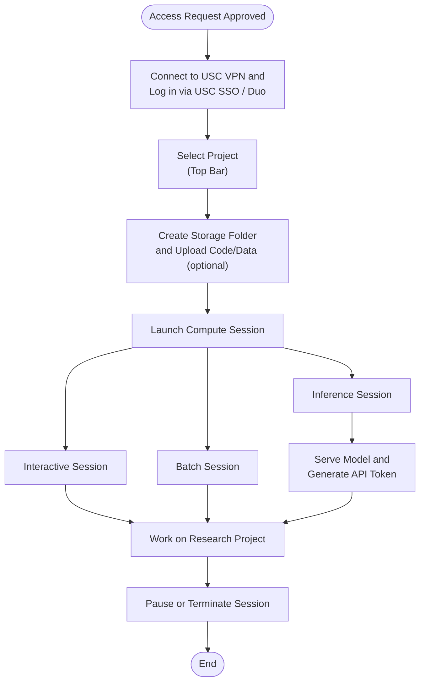

# Topanga Usage Workflow

## Steps

1. Once access is approved, **connect to the USC VPN** and then **log in via USC SSO / Duo** at [https://topanga.carc.usc.edu](https://topanga.carc.usc.edu).
2. **Select your project** in the top bar.
3. Optionally **create a storage folder** and upload code/data ahead of time.
4. **Launch a compute session**: Interactive, Batch, or Inference.
   - Inference sessions additionally require creating a model-definition file and generating an API token before serving traffic.
5. **Work on your research project**.
6. **Pause or terminate the session** when finished to manage cost and preserve state appropriately.
